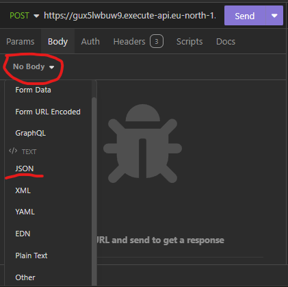

# **GRUPPEXAMINATION CRISIS AVERTED:**

<br>

### **KURS:**

_"Utveckling & driftsättning i molnmiljö."_

<br>

### **GRUPPMEDLEMMAR:**

Magnus, Sandra Anton och Daniel.

<br>
<br>

## **SETUP:**

<br>

> [!IMPORTANT]  
> **För att projektet ska fungera behöver du göra 2 saker:**

<br>

**På samma fil-nivå som serverless.yml skapa en fil med namn:**

```
personal.yml
```

<br>

**I den behöver du två properties:**

```
org: dittOrganisationsNamn
role: arnAdressenTillDinRollSomHarLambdaOchDynamoDbAccess
```

<br>
<br>

## **Förklaring:**

<br>

Din "serverless.yml" har redan sökvägarna till "personal.yml" men det fungerar såhär:

```
custom:
  secrets: ${file(./personal.yml)}
```

<br>

"custom" är en reserverad property i serverless. I den kan man spara properties som man själv bestämmer namnet på.<br>
I det här fallet har en property namnet secrets och håller sökvägen till en fil som håller properties med personlig information.

<br>

Ett exempel på hur du stegar sökvägen till en property i "personal.yml", i det här fallet org:

```
org: ${self:custom.secrets.org}
```


# **API anrop:** 

<br>

Vid en serverless deploy av projektet så returneras flera URL för alla våra anrop.
Använd de med t.ex. Insomnia eller Postman (vi använder Insomnia) för att göra saker som hämta, skicka in eller uppdatera data. Strukturen för alla URL:er som vi använder ser ut som nedan. För vissa anrop kan det behövas skickas med data i request body, se nedan bild för vart man skall ange data:



## GET - Hämta alla rum

För att få alla rum:

``` 
https://ErsättDennaURLMedDinURL/rooms 
```
## GET - Hämta alla order

För att få alla order:

``` 
https://ErsättDennaURLMedDinURL/orders
```

## POST - Lägg en order

För att lägga en order

```
https://ErsättDennaURLMedDinURL/orders
```
För att skicka en order mot detta anrop så skall detta skickas in: (Detta är exempeldata, du kan skicka in vad du vill)
```
{
	"name" : "TestOrder", {#Required#}
	"email" : "mail@test.com", {#Required#}
	"guests" : 4, {#Required#}
	"single" : 2, {#Optional#}
	"double" : 1, {#Optional#}
	"suite" : 0, {#Optional#}
	"arrival" : "2024-09-11", {#Required#}
	"departure" : "2024-09-12"{#Required#}
}
``` 

## PUT - Uppdatera en order

För att uppdatera en order. Här byter du ut {orderID} i din URL mot det åttasiffriga orderID som din order har, då utan '{ }' klammor.

```
https://ErsättDennaURLMedDinURL/orders/{orderID}
```
För att uppdatera en order mot detta anrop så skall detta skickas in: (Detta är exempeldata, du kan skicka in vad du vill)
```
{
	"guests" : 4, {#Optional#}
	"single" : 2, {#Optional#}
	"double" : 1, {#Optional#}
	"suite" : 0, {#Optional#}
	"arrival" : "2024-09-11", {#Optional#}
	"departure" : "2024-09-12"{#Optional#}
}
```

## DELETE - Radera en order

För att radera en order. Här byter du ut {orderID} i din URL mot det åttasiffriga orderID som din order har, då utan '{ }' klammor.

```
https://ErsättDennaURLMedDinURL/orders/{orderID}
```
